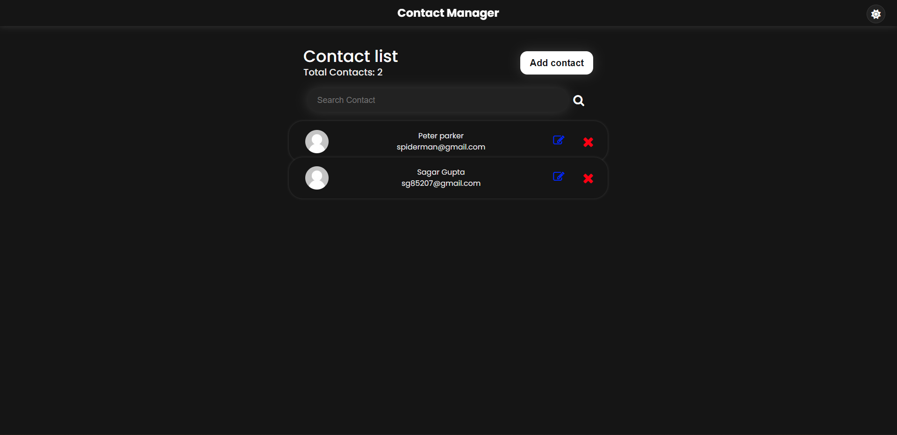
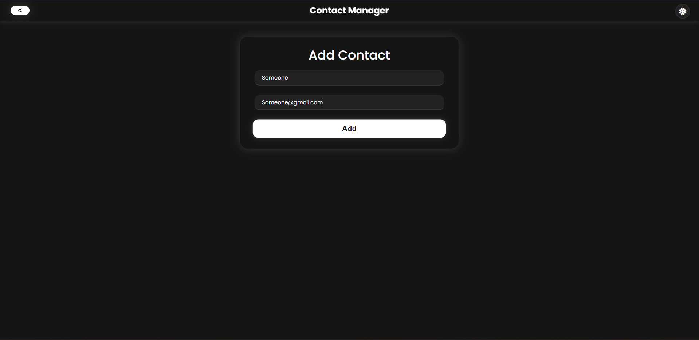
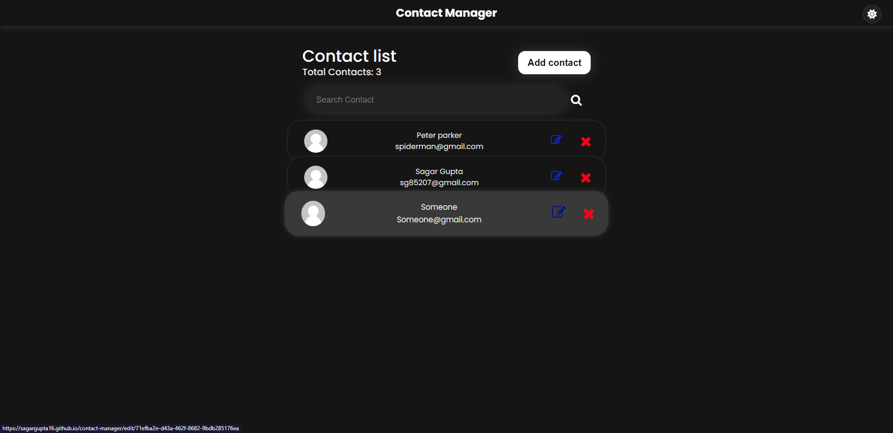
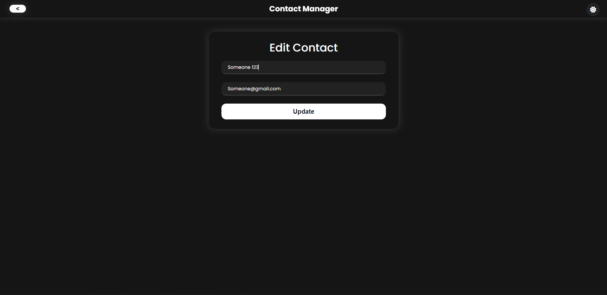
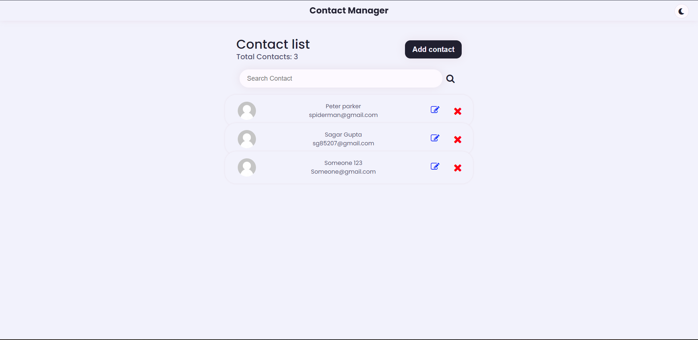
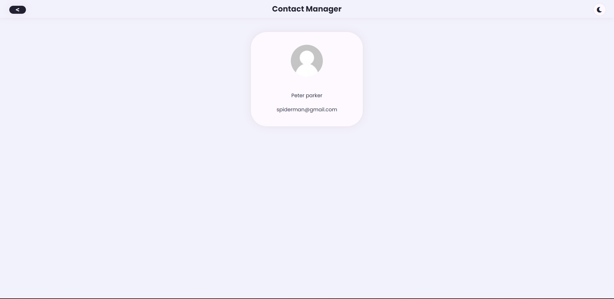
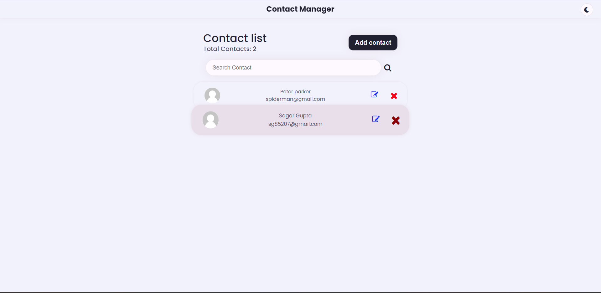

# Contact Manager

#### Project deployed link -> [Contact Manager](https://contact-manager-mern-cg19.onrender.com/)

---

## :pencil: About The Project

Contact Manager is a web application that allows users to manage their contacts with privacy.

---

## :cloud: Overview

This project is created as a MERN (MongoDB, Express.js, React, Node.js) App. It allows users to add, edit, delete, and search for contacts, along with viewing individual contact details. The project also includes a Switching between dark and light mode, and the user's theme preference is saved in local storage, so the mode will remain the same as the last time they left. All data is saved on the MongoDB server, and the project has a 0 refresh rate achieved using routers.

---

## 💻 Tech Stack

- Basics: HTML, CSS, and Javascript.
- Client: React, Redux, and React Router.
- Server: Nodejs, Expressjs, and MongoDB.

---

## :floppy_disk: Project Files Description

### Frontend

- **client/public/index.html**: This File contains stylesheet links and root div.
- **client/src/components/App.js**: This JS File imports all other JS component files and binds them together with the help of the router. Its content is spread throughout all routes.
- **client/src/components/AddContact.js**: This contains the HTML structure of the /addcontact route, which takes data in form-based and passes it to app.js, which stores it in local storage.
- **client/src/components/App.css**: This contains all the styling of each route page.
- **client/src/components/ContactCard.js**: This contains each individual contact card's details displayed on the front page, along with edit and delete buttons.
- **client/src/components/ContactDetails.js**: This contains details of individual contacts when tapped on them.
- **client/src/components/ContactList.js**: This contains the full list of all contacts displayed on the front page.
- **client/src/components/EditContact.js**: This File Contains the editing page UI where you can edit contact details from old data.
- **client/src/components/Header.js**: This contains the header part which is a fixed part for every route.
- **client/src/components/darkmode.js**: This contains the dark mode switching feature onclick and also saves the selected mode to local storage.
- **client/src/components/predata.js**: This is an array of data that is given from before.
- **client/src/index.js**: This binds App.js to the HTML root div.

### Backend

- **config/db.js**: This contains the Database Connectivity function.
- **config/default.js**: This contains the Database URL (i.e. MongoURL).
- **models/Contact.js**: This contains the structure of the Contact.
- **routes/api/contacts.js**: This contains all CRUD operation routes to be performed.
- **index.js**: This is the main file of the backend or server side.

---

## 📼 How you can run it Locally

1. Go to the code section above and download it as a zip.
2. Extract the zip file, then open the extracted folder in vscode.
3. Press ctrl+j on Windows, it will open the terminal to this folder.
4. Now run the command npm run dev, which will launch this on localhost:3000 and the server at localhost:3006. (If it doesn't redirect you, then manually search localhost:3000).
5. Done! Now you will be able to see the project running on your system.

---

## Project Images

