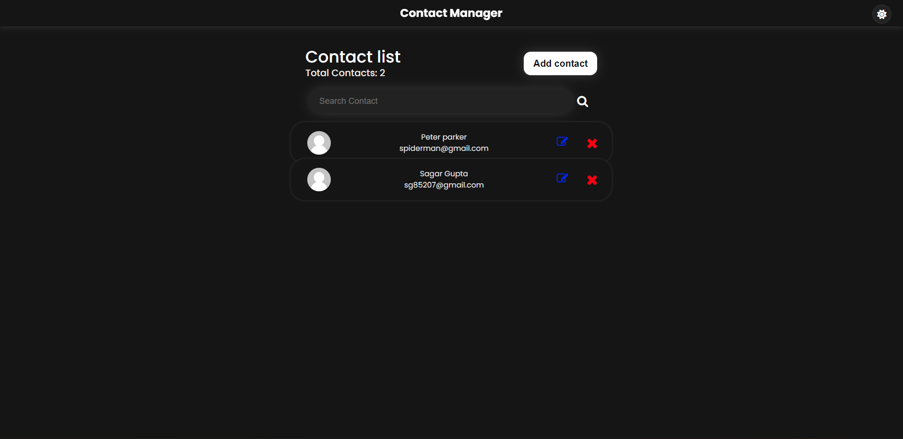
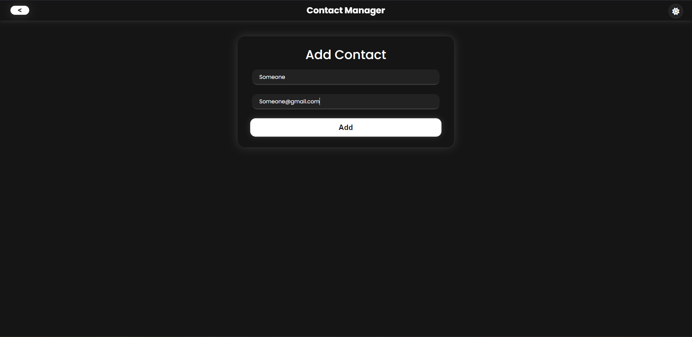
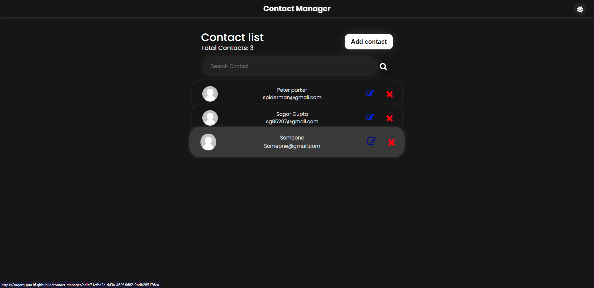

# Contact Manager (MERN)


**[View Live Demo](https://sagargupta.online/Contact-Manager-Mern/)**

A full-stack contact management application built with the MERN stack, featuring MongoDB persistence, dark/light mode, and real-time CRUD operations.


## Live Demo

[sagargupta16.github.io/Contact-Manager-Mern](https://sagargupta16.github.io/Contact-Manager-Mern/)

Backend API: [contact-manager-mern-cg19.onrender.com](https://contact-manager-mern-cg19.onrender.com/)

## Overview

A MERN (MongoDB, Express.js, React, Node.js) contact management application that provides full CRUD operations for contacts with a MongoDB backend. Features dark/light mode with localStorage persistence and zero-refresh navigation using React Router.

## Features

- **Add Contacts** -- Create new contacts with name and email
- **Edit Contacts** -- Update existing contact information
- **Delete Contacts** -- Remove contacts from the database
- **Search** -- Filter contacts by name or email
- **Contact Details** -- View individual contact information
- **Dark/Light Mode** -- Theme toggle persisted in localStorage
- **MongoDB Persistence** -- All data stored in MongoDB
- **Zero-Refresh Navigation** -- SPA routing with React Router

## Tech Stack

| Layer            | Technology                        |
| ---------------- | --------------------------------- |
| Frontend         | React 19, React Router 7, CSS     |
| Backend          | Node.js, Express 5                |
| Database         | MongoDB, Mongoose 8               |
| Dev Tools        | Concurrently, Nodemon             |
| Frontend Hosting | GitHub Pages (via GitHub Actions) |
| Backend Hosting  | Render                            |

## Project Structure

```
Contact-Manager-Mern/
├── client/                     # React frontend
│   ├── public/
│   └── src/
│       └── components/
│           ├── App.js          # Root with routing and state
│           ├── AddContact.js   # Add contact form
│           ├── EditContact.js  # Edit contact form
│           ├── ContactList.js  # Contact list display
│           ├── ContactCard.js  # Individual contact card
│           ├── ContactDetail.js # Contact detail view
│           ├── Header.js       # App header
│           └── darkmode.js     # Theme toggle
├── config/
│   ├── db.js                   # MongoDB connection
│   └── default.json            # Database URL config
├── models/
│   └── Contact.js              # Contact Mongoose schema
├── routes/
│   └── api/
│       └── contacts.js         # CRUD API routes
├── index.js                    # Express server entry
└── package.json
```

## Getting Started

### Prerequisites

- Node.js 22+
- MongoDB (local or Atlas)

### Installation

```bash
git clone https://github.com/Sagargupta16/Contact-Manager-Mern.git
cd Contact-Manager-Mern

# Install all dependencies (backend + frontend)
npm install && cd client && npm install && cd ..
```

### Configuration

Update `config/default.json` with your MongoDB connection string:

```json
{
  "mongoURI": "your_mongodb_connection_string"
}
```

### Running

```bash
npm run dev
# Frontend: http://localhost:3000
# Backend:  http://localhost:3006
```

## API Endpoints

| Method | Endpoint                    | Description        |
| ------ | --------------------------- | ------------------ |
| GET    | `/api/contacts`             | Get all contacts   |
| GET    | `/api/contacts/contact/:id` | Get single contact |
| POST   | `/api/contacts`             | Create contact     |
| PUT    | `/api/contacts/:id`         | Update contact     |
| DELETE | `/api/contacts/:id`         | Delete contact     |

## Screenshots





## Changelog

### v2.0.0 -- Warm Editorial Craft UI Redesign

- **Typography overhaul**: Replaced Inter with Playfair Display (serif headings) + DM Sans (body) for a premium editorial feel
- **Warm color system**: Terracotta, amber, and sand palette replacing cold purple/indigo. Dark mode uses warm charcoal tones
- **Name-seeded avatar gradients**: Each contact gets a unique, consistent gradient derived from their name
- **Staggered card animations**: Contacts cascade in with elastic easing on page load
- **Hover-reveal actions**: Edit/delete buttons slide in on card hover, keeping the UI clean
- **Textured backgrounds**: Subtle SVG noise overlay and radial gradient orbs for depth
- **Header accent stripe**: Warm gradient line at the top of the header and modals
- **Refined toasts**: Themed toast notifications with warm left-border accents
- **Dark mode cleanup**: Improved toggle using proper button element for accessibility
- **Responsive polish**: Action buttons always visible on mobile, tighter spacing on small screens

## More Projects

| Project | Description |
|---------|-------------|
| [Financial Dashboard](https://github.com/Sagargupta16/Financial-Dashboard) | Modern React financial dashboard with analytics and data visualization |
| [LeetCode Rating Predictor](https://github.com/Sagargupta16/LeetCode_Rating_Predictor) | Full-stack ML-powered LeetCode contest rating predictor |
| [InstagramLikesLeaderboard](https://github.com/Sagargupta16/InstagramLikesLeaderboard) | Browser tool showing who likes your Instagram posts the most |
| [claude-cost-optimizer](https://github.com/Sagargupta16/claude-cost-optimizer) | Save 30-60% on Claude Code costs - proven strategies and benchmarks |

## License

MIT
